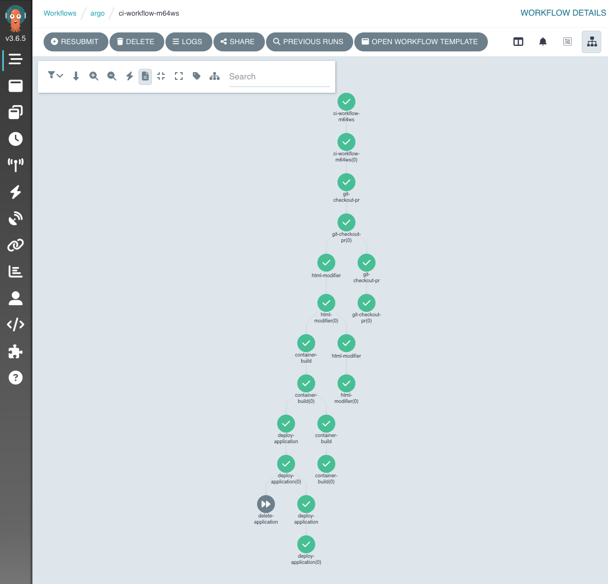

[](https://pipekit.io?utm_campaign=ci-example)


# Argo Workflows - Example CI
* A basic CI leveraging [Argo Workflows](https://argo-workflows.readthedocs.io/en/latest/) and [Argo CD](https://argoproj.github.io/argo-cd/).
* A second, basic CI leveraging [Argo Workflows](https://argo-workflows.readthedocs.io/en/latest/) and [Argo Rollouts](https://argoproj.github.io/argo-rollouts/).




## The Workflow...
* pulls a repo from git. Specifically simulating pulling a branch based on a pull request;
* merges the target branch into it;
* modifies the html that will be copied into the container to inject the unique name of the running workflow;
* builds a container from a Dockerfile and pushes to a registry;
* deploys an Argo CD application that uses the newly-built container to deploy a static website.

It does not pretend to be a definitive example, but it aims to inspire.
In order to make this a semi-usable example, we have cut a number of security corners. Please don't just blindly run this in production.

# Software Used:
This example installs a number of software packages:

- Argo CD
- Argo Workflows
- Ingress-Nginx
- nfs-server-provisioner
- Kubernetes

If you believe any to be out of date, a Pull Request is very welcome.

## Prerequisites
### Running Locally
In order to run this locally, you will need [k3d](https://k3d.io/) installed, as well as kubectl.
Your cluster will need to able to see the internet, specifically this repository in GitHub, because Argo CD pulls config to manage the installation of applications.

Note, this example spins up roughly 20 pods in the cluster, even before you run a workflow, so you'll need to allocate a half-decent amount of resources to Docker to run this example.

### Running on a remote cluster
The summary is "probably don't". If you really want to run on a remote cluster, you will need to use an empty cluster that you don't care about. This script blindly installs and configures a number of tools and has no regard for what you already have installed. It also makes assumptions about things like the container registry URL and ingress URLS that you will need to manually change in order to make it work.

You will need to remove the k3d cluster creation step from the script.

## Steps to Run
```bash
chmod +x setup.sh
./setup.sh
```
Once the setup is completed (3-7 mins depending on how sprightly your local machine is feeling), you can view the argo-workflows UI at https://localhost:8443/argo/workflows/argo (the S in https is important and you'll need to accept the self-signed certificate). Make sure you are looking at the 'argo' namespace.

### Run the workflow using yaml

Then you can deploy the workflow and you should see it appear in the UI.
```bash
kubectl -n argo create -f workflow.yml
```

### Run the workflow using [Hera](https://hera.readthedocs.io/en/stable/)

Ensure you have python and the hera framework installed.

You can deploy all the templates and run the workflow using
```bash
python hera/nfs/workflow.py
```

This achieves the same goals as the YAML version, but it is not an exact match in implementation to show a more Pythonic way of working.

### Looking at the workflow run

Once the workflow has successfully run, you can navigate to https://localhost:8443/workflows-ci-example/ in your browser. The website should tell you the branch that it was built from (the default is 'example') and the name of the workflow that built it.

You can delete the Argo CD application to remove the deployment. You should do this before re-running the workflow:
```bash
kubectl -n argocd delete application final-application
```

You can of course adjust other parameters as you see fit, and keep running the workflows to experiment. You may need to change the final-application deployment.

# Deleting the cluster
```bash
k3d cluster delete workflows-ci
```

# Running in production
This is a very simplified workflow aiming to highlight what's possible using Argo Workflows. Some things to consider when running in production:

* Triggering the CI using Argo Events. You can use the [Resource Example from the Argo Events repository](https://github.com/argoproj/argo-events/blob/master/examples/sensors/resource.yaml) to help guide you in how to achieve this. In order for this to work, you will need a public-facing webhook ingress endpoint, which is why it's not included in this example.
* Storing secrets more sensibly and injecting them only when required. We use Hashicorp Vault to achieve this. We strongly advise against putting any secret into git.
* Leveraging things like AWS spot instances and the cluster autoscaler to keep node costs down.
* Using much more restrictive Argo CD and Argo Workflows RBAC policies.
* Using something like the [ci-github-notifier](https://github.com/crumbhole/ci-github-notifier) to annotate pull requests and branches with the status of your CI.
* Use dedicated images for the job. Don't pull alpine and install git on each run, use a custom alpine-git image. We just did the example this way to reduce the number of dependencies required to get up and running.


# So what's happening?
## Setup
After creating a new local cluster, we install Argo CD, which is configured to look at the [bootstrap/applications](bootstrap/applications/) directory to install all other other applications.

Argo CD then continues to manage these applications, ensuring that your cluster reflects the configuration stored in Git.

Argo CD also deploys all our workflow templates for us. This means we don't have to manage a complex release process for them. We simply get them to the main branch of git (either directly, or through a proper Pull Request process with reviews etc) and Argo CD handles the deployment.

The [Argo Workflows Installation](bootstrap/argo-workflows/) is as out-of-the-box as we could make it while still providing an easy example. We adjust the controller config to ensure that Workflows releases PVCs when workflows are complete, as well as some other minor configuration for ease of demonstration. We patch the argo-server to disable a requirement for login, and to hide some popups that first-time users will see... again, all with the aim to make the example as smooth as possible.

Finally, because we intend on using the Workflow to deploy an application into the 'argocd' namespace from the 'argo' namespace, we adjust the Kubernetes rbac to allow the argo serviceAccount read/write access to the argocd namespace.

ingress-nginx is installed purely to allow you to access the Argo Workflows UI and the UI of your final application.

nfs-server-provisioner allows us to mount an NFS share into the workflow. This allows for multiple steps to interact with the same volume, even in parallel. nfs-server-provisioner uses disk on your nodes to achieve this. An alternative approach is to use Argo Workflows' archive feature to allow you to push data to a remote location such as S3.  For CI, this can be quite costly, pushing and pulling the data for each step in a workflow will not be efficient. Keeping the data as physically close to the compute as possible is a good idea.

## Workflow Logistics
The main workflow template that is being called for the NFS flow is [ci-workflow.yaml](bootstrap/workflow-templates/nfs/ci-workflow.yml). This requests the appropriate volumes, optionally sets up some prometheus metrics and defines the actual DAG for the workflow.

Most of the other steps called with in that workflow are themselves in [their own workflow template](bootstrap/workflow-templates/). This makes it easier for future expansion, and means you don't need to write a duplicate workflow for each CI job. In order for this to work, you should parametrise as much as is sensibly possible within your workflow templates. We have done so here as an example, but there is probably room for improvement.

The docker container build is performed by [Buildkit](https://github.com/moby/buildkit), but we offer a [Kaniko](https://github.com/GoogleContainerTools/kaniko)-based workflow template if you want to use that instead. You can challenge yourself by swapping the Buildkit workflow template for the Kaniko one. We have found Buildkit to be marginally more performant than Kaniko in real-world testing, but your mileage may vary depending on your use case.

We would normally recommend taking the time to write custom templates for each workflow step, rather than using generic containers and installing/upgrading software on the fly [as we have done here]((bootstrap/workflow-templates/git-checkout.yml)). Reinstalling software on each workflow run is not efficient.

## Prometheus metrics
Your workflows can output useful metrics to allow you to track and alert on the performance of your CI jobs.
We have included some sample metrics here, but haven't gone to the length of installing and setting up prometheus. Feel free to do so!

After running the workflow at least once, you can port-forward to the workflow-controller service to view the metrics:

```
kubectl -n argo port-forward svc/workflow-controller-metrics 9090:9090
```

In your browser, navigate to `http://localhost:9090/metrics` to see the raw prometheus metrics.

## Using S3/Minio instead of NFS
Some people may choose to use s3 instead of NFS. This is possible, and we have written an example into this repo.

You can run the following command to trigger the same workflow, using minio to pass the artifacts between steps.

```
kubectl -n argo create -f workflow-s3.yml
```

# Argo Rollouts
Now that you understand how you could deploy using Argo Workflows and Argo CD, you may wish to experiment with Argo Rollouts. This is a more advanced deployment tool that allows you to do things like canary deployments and blue/green deployments.

Typically, you would use Argo Rollouts in combination with Argo CD, to control the rate at which your application is deployed to your cluster. Unfortunately, this is not possible to include in this example without requiring you to fork this repo to be able to make changes to git that Argo CD picks up.

As an alternative, we have provided an additional Workflow that performs the following steps:

* pulls a repo from git. Specifically simulating pulling a branch based on a pull request;
* merges the target branch into it;
* modifies the html that will be copied into the container to inject the unique name of the running workflow;
* builds a container from a Dockerfile and pushes to a registry;
* deploys a Kubernetes Deployment manifest that uses the newly-built container to deploy a static website;

Then a second workflow does the same but:
* builds a second container from a Dockerfile and pushes to a registry using a different tag;
* uses Argo Rollouts to control the rollout of this second image over the top of the first.

```bash
./setup.sh -rollouts
```

Once the setup is completed (3-7 mins depending on how sprightly your local machine is feeling), you can view the argo-workflows UI at https://localhost:8443/argo/workflows/argo (the S in https is important and you'll need to accept the self-signed certificate). Make sure you are looking at the 'argo' namespace.

### Run the rollouts workflow using yaml

* Deploy the workflow and you should see it appear in the Argo Workflows UI.
```bash
kubectl -n argo create -f rollouts-workflow.yml

# If you prefer to use the minio/s3/artifacts version, you can run:
kubectl -n argo create -f rollouts-workflow-s3.yml

# If you prefer to run using Hera, Ensure you have python and the hera framework installed and run:
python hera/nfs/rollouts-workflow.py
```

* View the resulting application in your browser at https://localhost:8443/workflows-ci-example/
* View the resulting pods for the application in your cluster by running:
```bash
kubectl -n final-application get pods
```

* Run the second workflow to see the canary deployment in action:
```bash
kubectl -n argo create -f rollouts-workflow-2.yml
kubectl -n final-application get rollouts --watch

# If you prefer to use the minio/s3/artifacts version, you can run:
kubectl -n argo create -f rollouts-workflow-s3-2.yml
kubectl -n final-application get rollouts --watch

# If you prefer to run using Hera, Ensure you have python and the hera framework installed and run:
python hera/nfs/rollouts-workflow-2.py
kubectl -n final-application get rollouts --watch
```

During the rollout, you can keep refreshing https://localhost:8443/workflows-ci-example/ in your browser to see the mix of old and new pods in play. As the rollout progresses, you will see the new pods take over from the old ones.

`rollouts-workflow(-s3)-2` is the exact same workflow as the one you previously ran, but with a different workflow parameter to set the image tag. This will cause Argo Rollouts to deploy the new image over the top of the old one at the cadence defined in the Rollout manifest:
```yaml
apiVersion: argoproj.io/v1alpha1
kind: Rollout
metadata:
    name: example-application
    namespace: final-application
spec:
    replicas: 5
    strategy:
    canary:
        steps:
        - setWeight: 20
        - pause: {duration: 10}
        - setWeight: 40
        - pause: {duration: 10}
        - setWeight: 60
        - pause: {duration: 10}
        - setWeight: 80
        - pause: {duration: 10}
...
```


---

# Further Help and Support

## Mac Users
Monterey (MacOS 12) and greater users might find that the k3d cluster doesn't start due to port 5000 being in use.
Apple automatically enables the Airplay Receiver option in the Airdrop & Handoff menu of System Settings. You can either disable this, or change port 5000 in this repo to something else.

## Argo Workflows Support

Pipekit’s team of Argo experts provide professional support for companies using Argo Workflows. Pipekit's Argo maintainers help platform teams optimize pipeline performance, squash upstream bugs, and make faster technical decisions. Learn more at [pipekit.io/services](https://pipekit.io/services?utm_campaign=ci-example).

For more information about Argo Workflows, please see the following resources:

* [The Argo Workflows Documentation](https://argoproj.github.io/argo-workflows/)
* [The Argo Workflows GitHub Repository](https://github.com/argoproj/argo-workflows/)
* [The Argo Workflows Slack Channel](https://cloud-native.slack.com/archives/C01QW9QSSSK)

## About Pipekit

Pipekit is the control plane for Argo Workflows. Platform teams use Pipekit to manage data & CI pipelines at scale, while giving developers self-serve access to Argo. Pipekit's unified logging view, enterprise-grade RBAC, and multi-cluster management capabilities lower maintenance costs for platform teams while delivering a superior devex for Argo users. Sign up for a 30-day free trial at [pipekit.io/signup](https://pipekit.io/signup?utm_campaign=ci-example).

# Acknowledgements
Thank you to [Sendible](https://www.sendible.com) for their outsized contributions to this repository.
